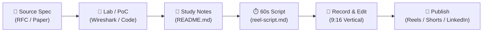

# 📚 ValidDoc: Technical Standards, Papers & CVE Deep Dives

[](LICENSE)
[](#content-pipeline)
[](#study-topics)

> A rigorous, public engineering repository dedicated to studying foundational computer science documents directly from the source—**IETF RFCs, CVE advisories, ACM/IEEE research papers, and ISO standards**—breaking them down into reproducible labs, concise documentation, and high-impact short-form video reels (45–60s).

---

## 🎯 The Philosophy
Most engineers learn from second-hand blog posts or tutorials. This repository goes straight to the **valid, authoritative source documents**:
1. **Read the primary spec** (no summaries, no hype).
2. **Build a working lab or PoC** to verify it in code or network traces.
3. **Condense into clean technical notes** in Git.
4. **Produce a punchy 60-second video reel** explaining the core breakthrough to the developer community.

---

## 🗺️ Master Study & Content Tracker

| Identifier | Category | Topic / Breakthrough | Deep-Dive Notes | Practical Lab | Reel Script | Reel Status |
|---|---|---|---|---|---|---|
| **RFC 9114** | `IETF RFC` | HTTP/3: Replacing TCP with QUIC & 0-RTT | [Notes](rfcs/rfc-9114-http3/README.md) | [Probe Script](rfcs/rfc-9114-http3/lab/test_http3.py) | [Script](rfcs/rfc-9114-http3/reel-script.md) | 🎥 Ready to Record |
| *CVE-2024-3094* | `CVE / Exploit` | XZ Utils Backdoor: IFUNC & Multi-Stage Payload | *Coming soon* | *In review* | *Scripting* | 📝 Backlog |
| *2017 Paper* | `Research Paper` | Attention Is All You Need (Transformers) | *Coming soon* | *In review* | *Scripting* | 📝 Backlog |
| *IEEE 802.11be* | `IEEE Standard` | Wi-Fi 7: Multi-Link Operation (MLO) & 320MHz | *Coming soon* | *In review* | *Scripting* | 📝 Backlog |

---

## 📂 Repository Architecture

```text
.
├── rfcs/                       # IETF Internet Standards (RFC 9114, RFC 8446, etc.)
│   └── rfc-9114-http3/
│       ├── README.md           # In-depth technical study & architectural breakdown
│       ├── reel-script.md      # 45-60s vertical video script + hook + b-roll cues + captions
│       ├── lab/                # PoC, packet traces, benchmarks, or test scripts
│       └── assets/             # Mermaid diagrams, slide graphics, packet captures
│
├── cves/                       # Real-world vulnerability root-cause analyses
│   └── cve-YYYY-XXXX/          # Memory safety, auth bypass, deserialization exploits
│
├── research-papers/            # Seminal CS papers (arXiv, ACM, USENIX, OSDI)
│   └── YYYY-topic/             # Consensus (Raft/Paxos), Distributed Systems, AI
│
├── standards/                  # Formal specs (ISO/IEC, IEEE, NIST, W3C)
│   └── standard-name/          # Cryptography, wireless, data formats, governance
│
├── articles/                   # Engineering blogs from top infra teams (Meta, Uber, AWS)
│
├── templates/                  # Standardized templates for rapid research
│   ├── RFC_TEMPLATE.md
│   ├── CVE_TEMPLATE.md
│   ├── PAPER_TEMPLATE.md
│   └── REEL_SCRIPT_TEMPLATE.md
│
└── scripts/
    └── new_study.py            # CLI generator to scaffold a new study workspace in 2 seconds
```

---

## ⚙️ Quickstart: Scaffold a New Study

Create a new research topic with pre-populated notes and video scripts using the built-in CLI:

```bash
# Interactive mode:
python3 scripts/new_study.py

# Or via CLI flags:
python3 scripts/new_study.py --type rfc --id 8446 --title "TLS 1.3 Handshake"
python3 scripts/new_study.py --type cve --id 2021-44228 --title "Log4Shell RCE"
python3 scripts/new_study.py --type paper --id 2014 --title "Raft Consensus"
```

This automatically sets up:
- `README.md` (pre-filled with the right markdown template & diagrams)
- `reel-script.md` (timed script with hook, B-roll cues, and social media copy)
- `lab/` (folder for your python tests, curl commands, or reproductions)
- `assets/` (folder for graphics and screenshots)

---

## 🎬 Reel & Short Video Production Workflow

Every technical topic follows a battle-tested short-form formula:



### Video Structure (45–60 Seconds)
1. **0:00 - 0:03 (The Hook):** Break a misconception or highlight a shocking stat (*"Why did internet engineers delete TCP?"*).
2. **0:03 - 0:15 (The Problem):** Demonstrate the real bottleneck (*Head-of-line blocking, memory corruption, slow consensus*).
3. **0:15 - 0:40 (Under The Hood):** Show the actual standard or code in terminal / Wireshark / diagram.
4. **0:40 - 0:50 (The Impact):** Performance gain, security fix, or modern industry adoption.
5. **0:50 - 0:60 (Call to Action):** Direct viewers to the open-source GitHub notes and reproduction code in bio.

---

## 🛡️ Educational Disclaimer
All CVE analyses and proof-of-concept scripts in this repository are created strictly for **defensive engineering, academic research, and educational purposes**.

---

## 📄 License
This repository is licensed under the [MIT License](LICENSE).
