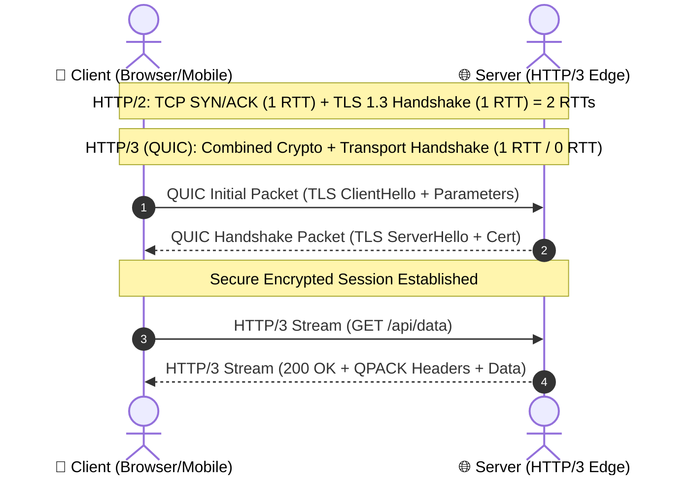

# RFC 9114: HTTP/3 (HTTP over QUIC)

> **Status:** Proposed Standard (IETF RFC 9114)  
> **Authors:** M. Bishop (Akamai)  
> **Source Link:** [RFC 9114 Official Specification](https://www.rfc-editor.org/rfc/rfc9114.html)  
> **Date Published:** June 2022  
> **Tags:** `#networking` `#http3` `#quic` `#ietf` `#protocols` `#tcp-vs-udp`

---

## ⚡ 30-Second Summary (The Elevator Pitch)
HTTP/3 replaces TCP with **QUIC** (which runs over UDP). While HTTP/2 solved application-layer head-of-line blocking by multiplexing streams over a single TCP connection, it created a severe transport-layer bottleneck: if a single packet drops, **all multiplexed streams stall** until TCP retransmits that packet. HTTP/3 fixes this permanently by moving stream multiplexing down into the transport layer with QUIC.

---

## 🎯 Background & The "Why"

| Protocol | Transport | Handshake Latency | Head-of-Line (HoL) Blocking | Connection Migration |
|---|---|---|---|---|
| **HTTP/1.1** | TCP + TLS | 2 - 3 RTT | Severe (1 request per TCP socket) | ❌ Broken on IP change (WiFi to 4G) |
| **HTTP/2** | TCP + TLS | 2 - 3 RTT | App-level fixed; **Transport HoL remains** | ❌ Broken on IP change |
| **HTTP/3** | UDP + QUIC | **0 - 1 RTT** (Integrated TLS 1.3) | **Zero HoL blocking** between independent streams | ✅ Seamless (Uses 64-bit Connection ID) |

### The TCP HoL Trap in HTTP/2:
In HTTP/2, you can download 50 images in parallel over one TCP socket. But TCP guarantees strict byte-stream ordering. If packet #4 (belonging to Image A) is dropped on cellular network loss, packets #5 through #50 (belonging to Images B, C, D) sit idle in the OS kernel buffer and cannot be read by the browser until packet #4 arrives.

---

## 🛠️ Key Technical Concepts & Mechanisms

### 1. QUIC Stream Independence
Under RFC 9114, each HTTP request/response lives in an independent QUIC stream. If Stream 2 loses a packet, Stream 4 continues streaming audio or CSS uninterrupted.

### 2. Zero Round-Trip Handshake (0-RTT)
By embedding TLS 1.3 inside QUIC packet frames, connection establishment and cryptographic negotiation happen simultaneously in a single round-trip (or 0-RTT on resumption).



### 3. QPACK Header Compression
HTTP/2 used HPACK, which required an in-order synchronized table between client and server. HTTP/3 introduces **QPACK** (RFC 9204), allowing out-of-order decompression without blocking the pipeline.

---

## 🔬 Practical Lab & Verification

You can verify HTTP/3 live on real infrastructure with `curl` built with `nghttp3` or `quiche`:

```bash
# Check if a domain supports HTTP/3 via Alt-Svc header
curl -I -s https://cloudflare.com | grep -i "alt-svc"
# Output example:
# alt-svc: h3=":443"; ma=86400

# Direct HTTP/3 connection
curl --http3 -I https://cloudflare.com
```

In [lab/test_http3.py](file:///Users/namanbhatt/learningfromvaliddoc/rfcs/rfc-9114-http3/lab/test_http3.py), we provide a lightweight automated probe to inspect `Alt-Svc` headers and QUIC support.

---

## 💡 Practical Takeaways for Engineers
1. **Mobile Performance Wins:** Users on fluctuating cellular networks (metro, elevators, switching WiFi to 5G) benefit most because QUIC avoids connection teardown.
2. **Firewall / UDP Throttling:** Some corporate firewalls or ISPs rate-limit or block UDP port 443; HTTP/3 clients must always fall back gracefully to HTTP/2 over TCP.

---

## 🔗 References & Primary Sources
- [RFC 9114 - HTTP/3](https://www.rfc-editor.org/rfc/rfc9114.html)
- [RFC 9000 - QUIC: A UDP-Based Multiplexed and Secure Transport](https://www.rfc-editor.org/rfc/rfc9000.html)
- [RFC 9204 - QPACK: Header Compression for HTTP/3](https://www.rfc-editor.org/rfc/rfc9204.html)
