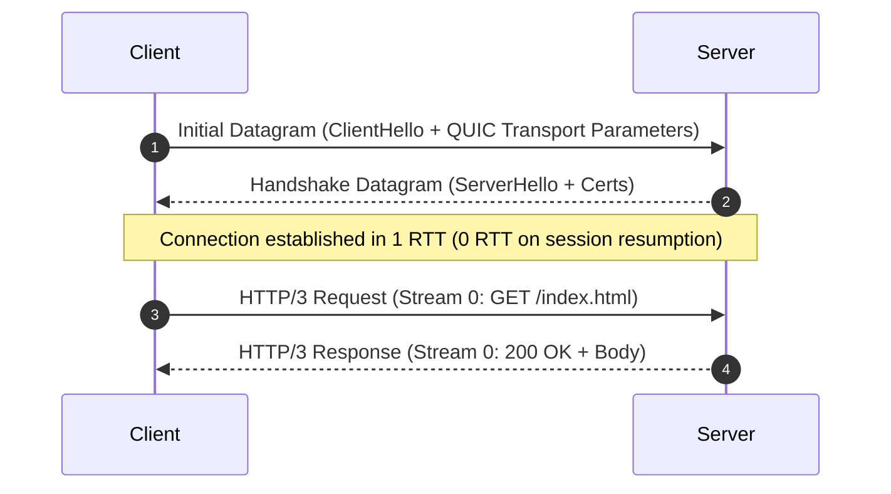

# RFC 9114: HTTP/3

- **Document:** RFC 9114 (Proposed Standard)
- **Author:** M. Bishop (Akamai Technologies)
- **Published:** June 2022
- **Link:** https://www.rfc-editor.org/rfc/rfc9114.html
- **Related:** RFC 9000 (QUIC Transport), RFC 9204 (QPACK)

---

## Overview

HTTP/2 introduced stream multiplexing over a single TCP connection so browsers wouldn't need to open 6 parallel TCP connections per domain. While this solved application-layer head-of-line (HoL) blocking, it introduced a worse problem at the transport layer: **TCP guarantees strict byte order**. 

If a single packet is lost on a flaky mobile network, TCP halts delivery of *all* other packets until the missing one is retransmitted—even if those packets belong to completely unrelated files (like a CSS stylesheet waiting on a dropped image chunk).

RFC 9114 standardizes HTTP over QUIC (running on UDP), pushing stream multiplexing into the transport protocol itself. Each HTTP request gets its own QUIC stream. If stream 3 drops a packet, stream 4 and 5 keep processing without waiting.

---

## Key Differences

| Feature | HTTP/1.1 | HTTP/2 | HTTP/3 |
|---|---|---|---|
| Underlying transport | TCP | TCP | UDP (via QUIC) |
| Multiplexing | No (pipelining was broken) | Yes (app layer) | Yes (transport layer) |
| Packet loss penalty | Affects single request | Stalls entire connection | Stalls only the lost stream |
| Handshake latency | 2–3 RTTs (TCP + TLS) | 2–3 RTTs | 1 RTT (0-RTT on reconnect) |
| Connection migration | Fails on IP/network switch | Fails on IP/network switch | Built-in via 64-bit Connection ID |

---

## Core Mechanics

### 1. Independent Streams
QUIC streams are created, transmitted, and reassembled independently. Packet loss on one stream does not block buffers for any other stream.

### 2. Integrated TLS 1.3 Handshake
Instead of doing a TCP 3-way handshake and then running a TLS handshake on top of it, QUIC bundles the cryptographic keys directly into the connection setup.



### 3. QPACK Instead of HPACK
HTTP/2 used HPACK to compress headers, which required strict sequential decompression. HTTP/3 uses **QPACK** (RFC 9204), allowing streams to decompress headers out of order safely.

---

## Testing & Verification

Most major websites (Cloudflare, Google, Facebook) serve HTTP/3 on production edges. They advertise it over HTTP/2 using the `Alt-Svc` response header.

### 1. Check for HTTP/3 Advertisement
```bash
curl -s -I https://cloudflare.com | grep -i alt-svc
```

Output:
```http
alt-svc: h3=":443"; ma=86400
```
This header tells the browser: *"Next time you talk to me, use HTTP/3 over UDP port 443."*

### 2. Direct HTTP/3 Request
Using curl compiled with HTTP/3 support:
```bash
curl --http3 -I https://cloudflare.com
```

### 3. Python Lab Script
I wrote a quick script in [lab/test_http3.py](file:///Users/namanbhatt/learningfromvaliddoc/rfcs/rfc-9114-http3/lab/test_http3.py) that queries multiple popular domains to see how they advertise HTTP/3 and what fallback headers they return.

---

## Personal Notes & Real-World Gotchas

1. **UDP Blocking:** Many enterprise and hotel firewalls still drop or throttle UDP traffic on port 443. Any client implementing HTTP/3 must retain automatic fallback to HTTP/2 over TCP.
2. **CPU Overhead:** Handling UDP in user-space can be more CPU-intensive for edge servers than kernel-optimized TCP (until technologies like eBPF and XDP become standard in QUIC server implementations).
3. **Connection Migration is huge for mobile:** Switching from home Wi-Fi to cellular does not disconnect the QUIC session because it tracks a 64-bit Connection ID rather than the client's source IP address.

---

## References
- [RFC 9114 (HTTP/3)](https://www.rfc-editor.org/rfc/rfc9114.html)
- [RFC 9000 (QUIC)](https://www.rfc-editor.org/rfc/rfc9000.html)
- [Cloudflare: The Road to QUIC](https://blog.cloudflare.com/the-road-to-quic/)
