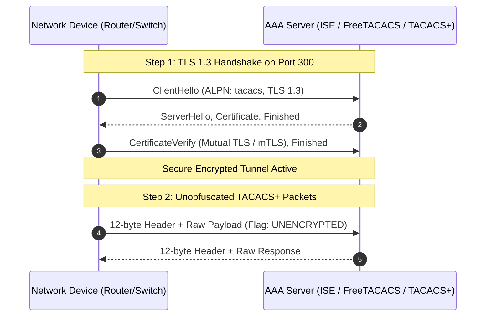

# TACACS+ Protocol Evolution: RFC 8907 to RFC 9887 (over TLS 1.3)

- **Primary Standards:** RFC 8907 (Informational, Sep 2020), RFC 9887 (Proposed Standard, Dec 2025)
- **Data Modeling:** RFC 9950 (YANG Model, obsoletes RFC 9105)
- **Assigned Ports:** TCP 49 (legacy `tacacs`), TCP 300 (secure `tacacss`)
- **Key RFC Track:** IETF OPSAWG (Operations and Management Area Working Group)
- **Tags:** `networking`, `security`, `aaa`, `tacacs-plus`, `tls13`, `ietf`

---

## Evolution Timeline

```text
1997: draft-grant-tacacs-02 (Cisco proprietary draft runs global enterprise infrastructure)
 │
2020: RFC 8907 published (Informational RFC codifies 23 years of real-world implementation)
 │
2025: RFC 9887 published (Standards Track: mandates TLS 1.3 on TCP port 300, retires MD5)
 │
2025: RFC 9950 published (Standards Track: YANG model for automated TACACS+ configuration)
```

For nearly three decades, TACACS+ was an undocumented standard. Network operators ran billions of dollars in critical infrastructure based on an expired 1997 draft (`draft-grant-tacacs-02`). In 2020, the IETF published RFC 8907 to formally document existing implementations while deprecating vulnerable legacy features (`SENDPASS` and server-side `FOLLOW`). In December 2025, RFC 9887 fundamentally modernized the protocol by replacing its broken MD5 obfuscation with mandatory TLS 1.3 transport.

---

## Architectural Comparison: TACACS+ vs RADIUS

Network access architectures generally rely on either TACACS+ or RADIUS (RFC 2865). Their design goals differ significantly:

| Dimension | TACACS+ (RFC 8907 / RFC 9887) | RADIUS (RFC 2865 / RFC 6614) |
|---|---|---|
| Primary Use Case | Device Administration (routers, switches, firewalls) | Network Access (802.1X, Wi-Fi, VPN user auth) |
| Transport Protocol | TCP (Port 49 legacy, Port 300 TLS) | UDP (Port 1812/1813 legacy, RadSec TCP 2083) |
| AAA Decoupling | Full separation: Authentication, Authorization, Accounting are independent | Combined: Authentication and Authorization bundled in one exchange |
| Granular Command Authorization | Yes: Inspects and authorizes every single CLI command per keystroke | No: Returns static privilege levels or profiles |
| Legacy Encryption | Entire payload obfuscated via MD5 XOR (Header in cleartext) | Only user password field encrypted via MD5; rest of packet plaintext |
| Modern Zero-Trust Standard | RFC 9887: Mandates native TLS 1.3 on TCP port 300 | RFC 6614 (RadSec): TLS over TCP port 2083 |

---

## The 12-Byte Header Anatomy

Every TACACS+ packet begins with an identical 12-byte fixed binary header (RFC 8907 Section 4.1):

```text
 0                   1                   2                   3
 0 1 2 3 4 5 6 7 8 9 0 1 2 3 4 5 6 7 8 9 0 1 2 3 4 5 6 7 8 9 0 1
+-+-+-+-+-+-+-+-+-+-+-+-+-+-+-+-+-+-+-+-+-+-+-+-+-+-+-+-+-+-+-+-+
|major_version  | minor_version |     type      |     seq_no    |
+-+-+-+-+-+-+-+-+-+-+-+-+-+-+-+-+-+-+-+-+-+-+-+-+-+-+-+-+-+-+-+-+
|     flags     |                   session_id                  |
+-+-+-+-+-+-+-+-+-+-+-+-+-+-+-+-+-+-+-+-+-+-+-+-+-+-+-+-+-+-+-+-+
|        session_id (cont.)     |             length            |
+-+-+-+-+-+-+-+-+-+-+-+-+-+-+-+-+-+-+-+-+-+-+-+-+-+-+-+-+-+-+-+-+
|             length (cont.)    |
+-+-+-+-+-+-+-+-+-+-+-+-+-+-+-+-+
```

### Field Definitions:
1. **major_version (4 bits):** Set to `0xc` (12) for TACACS+.
2. **minor_version (4 bits):** `0x0` for standard, `0x1` for legacy variants.
3. **type (8 bits):** Packet type:
   - `0x01`: Authentication
   - `0x02`: Authorization
   - `0x03`: Accounting
4. **seq_no (8 bits):** 1-byte counter. Increments by 1 for each packet in a session. Must begin at 1.
5. **flags (8 bits):**
   - Bit 0 (`0x01`): `TAC_PLUS_UNENCRYPTED_FLAG`. If set, the payload is cleartext.
   - Bit 2 (`0x04`): `TAC_PLUS_SINGLE_CONNECT_FLAG`. Allows multiple sessions over a persistent TCP socket.
6. **session_id (32 bits):** A cryptographically random unsigned integer tracking the conversation.
7. **length (32 bits):** Total length in bytes of the following payload (excluding the 12-byte header).

---

## Cryptographic Breakdown: Why Legacy MD5 Failed

In RFC 8907, the payload was "encrypted" using an MD5-based XOR stream cipher:

$$\text{pad}_1 = \text{MD5}(\text{session\_id} \parallel \text{shared\_secret} \parallel \text{version} \parallel \text{seq\_no})$$
$$\text{pad}_{i+1} = \text{MD5}(\text{session\_id} \parallel \text{shared\_secret} \parallel \text{version} \parallel \text{seq\_no} \parallel \text{pad}_i)$$

$$\text{ciphertext} = \text{plaintext} \oplus \text{pad}$$

### Why this is broken:
1. **Cleartext Header Metadata:** The `session_id`, `version`, and `seq_no` are transmitted in plain view inside the 12-byte header.
2. **Known-Plaintext Vulnerability:** Because packet structures contain highly predictable headers and static fields (such as usernames and status codes), an observer who captures network traffic can deduce the pseudo-random pad and extract the pre-shared key via offline dictionary/rainbow table attacks.
3. **No Cryptographic Integrity:** There is no HMAC, digital signature, or authentication tag. An active attacker can bit-flip authorization response fields from `TAC_PLUS_AUTHOR_STATUS_FAIL` (`0x10`) to `TAC_PLUS_AUTHOR_STATUS_PASS_ADD` (`0x01`).

---

## RFC 9887: Native TACACS+ over TLS 1.3

RFC 9887 resolves these structural flaws for modern zero-trust deployments:



### Key Requirements of RFC 9887:
1. **Mandatory TLS 1.3:** TLS 1.3 is the required baseline. TLS 1.2 is only permitted under strict migration conditions; older versions (SSLv3, TLS 1.0, 1.1) are forbidden.
2. **Dedicated Port 300 (`tacacss`):** Replaces legacy Port 49. Prevents opportunistic downgrade attacks.
3. **ALPN Tag `tacacs`:** TLS negotiation includes the Application-Layer Protocol Negotiation identifier `tacacs`.
4. **Disabling Legacy Obfuscation:** Inside the TLS tunnel, packets set `TAC_PLUS_UNENCRYPTED_FLAG = 1`. Double-encrypting with obsolete MD5 was eliminated because TLS already provides authenticated encryption (AEAD).
5. **Mutual Authentication (mTLS):** Routers and TACACS+ servers authenticate each other using X.509 digital certificates, eliminating weak pre-shared secrets.

---

## RFC 9950: YANG Data Modeling & Automation

To support modern network automation (NETCONF/RESTCONF), RFC 9950 defines the `ietf-system-tacacs-plus` YANG module conforming to the Network Management Datastore Architecture (NMDA).

### Key Configuration Branches in YANG:
- **Server Address & Port:** Supports IPv4/IPv6 and port selection (Port 49 legacy vs. Port 300 TLS).
- **Transport Specification:**
  - `tcp`: Legacy connection with shared-secret authentication.
  - `tls`: Modern connection referencing certificate authorities, client certificates, and TLS 1.3 parameters.
- **Failover & Timers:** Standardizes timeout parameters and backup server lists across heterogeneous vendor hardware.

---

## Practical Wireshark Packet Capture & Dissection Lab

This repository includes a byte-accurate, RFC 8907 compliant packet capture file ([lab/tacacs_rfc8907_session.pcap](file:///Users/namanbhatt/learningfromvaliddoc/rfcs/rfc8907-rfc9887-tacacs-plus/lab/tacacs_rfc8907_session.pcap)) generated via [lab/generate_tacacs_pcap.py](file:///Users/namanbhatt/learningfromvaliddoc/rfcs/rfc8907-rfc9887-tacacs-plus/lab/generate_tacacs_pcap.py).

It models a complete authentication and authorization sequence between a Cisco router (`192.168.10.1`) and a TACACS+ server (`192.168.10.254` on TCP port 49) using shared secret `cisco123`.

### Captured Frame Sequence

| Frame | Protocol | Type | Details |
|---|---|---|---|
| **1–3** | TCP | Handshake | Client `49152` connects to Server `49` (SYN, SYN-ACK, ACK) |
| **4** | TACACS+ | Authen START | Inbound login for user `admin` on port `tty0` |
| **6** | TACACS+ | Authen REPLY | Status `GETPASS` (`0x02`), Server message: `Password: ` |
| **8** | TACACS+ | Authen CONTINUE | User enters password: `SecretAdminPass2026` |
| **10** | TACACS+ | Authen REPLY | Status `PASS` (`0x01`), Authentication successful |
| **12** | TACACS+ | Author REQUEST | User requests CLI execution: `cmd=show running-config` |
| **14** | TACACS+ | Author RESPONSE | Status `PASS_ADD` (`0x01`), Command authorized |
| **16–18** | TCP | Teardown | Graceful connection closure (FIN, ACK) |

### How to Inspect in Wireshark:

1. Open `lab/tacacs_rfc8907_session.pcap` in Wireshark.
2. Initially, the packet bodies appear as raw obfuscated hex because RFC 8907 masks payloads with MD5 XOR.
3. Configure Wireshark's native dissector:
   - Navigate to: **Preferences** -> **Protocols** -> **TACACS+**
   - Set **TACACS+ Encryption Key** to: `cisco123`
4. Wireshark automatically re-computes the MD5 keystream and decrypts every frame in the protocol tree, exposing the raw username, password, and requested CLI commands.

### Terminal Verification via tshark:

```bash
# View summary flow:
tshark -r lab/tacacs_rfc8907_session.pcap

# Decrypt live and print authorization commands:
tshark -r lab/tacacs_rfc8907_session.pcap -o tacplus.key:cisco123 -Y "tacplus" -O tacplus
```

---

## Device Configuration Examples

### Cisco IOS-XE (Migrating from Legacy to TLS)

Legacy configuration (RFC 8907 / Port 49):
```text
tacacs server TACACS-LEGACY
 address ipv4 10.10.10.25
 key 7 070C285F4D06
!
aaa group server tacacs+ TACACS-GRP
 server name TACACS-LEGACY
```

Modern configuration (RFC 9887 / TLS 1.3 / Port 300):
```text
tacacs server TACACS-SECURE
 address ipv4 10.10.10.25
 port 300
 tls-profile TACACS-TLS-PROFILE
!
crypto pki profile tls TACACS-TLS-PROFILE
 trustpoint CORP-ROOT-CA
 certificate client ROUTER-IDENTITY-CERT
 version tls13
```

---

## Side Notes & Technical Glossary

- **AAA:** Authentication (verifying identity), Authorization (enforcing command access per privilege level), Accounting (logging every executed command and timestamp).
- **Informational vs. Standards Track:** An Informational RFC records existing operational practices without making them formal requirements. A Standards Track RFC defines the official engineering blueprint that all conformant implementations must adhere to.
- **Pre-Shared Secret:** A shared password configured on both the router and the AAA server. Highly vulnerable to brute-forcing when used with weak hash algorithms.
- **Mutual TLS (mTLS):** A security process where both the client (router) and server (AAA appliance) authenticate each other using cryptographic certificates before exchanging data.
- **ALPN:** Application-Layer Protocol Negotiation. An extension in the TLS handshake that allows the client and server to agree on the application protocol inside the tunnel before sending traffic.
- **NMDA:** Network Management Datastore Architecture. An IETF standard defining how network operating systems separate candidate, running, startup, and operational configuration states.

---

## References
- [RFC 8907: The TACACS+ Protocol](https://www.rfc-editor.org/rfc/rfc8907.html)
- [RFC 9887: TACACS+ over TLS 1.3](https://www.rfc-editor.org/rfc/rfc9887.html)
- [RFC 9950: A YANG Data Model for TACACS+](https://www.rfc-editor.org/rfc/rfc9950.html)
- [RFC 2865: Remote Authentication Dial In User Service (RADIUS)](https://www.rfc-editor.org/rfc/rfc2865.html)
