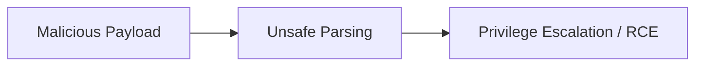

# [CVE-ID]: [TITLE / VULNERABILITY NAME]

- **CVSS Score:** [e.g., 9.8 Critical]
- **Affected Software:** [e.g., Log4j 2.0-beta9 through 2.14.1]
- **Patched In:** [Version number]
- **Primary Advisory:** [Link to NVD or vendor advisory]
- **Tags:** `[tag1]`, `[tag2]`

---

## What Happened (Summary)
Brief plain-English summary of what the vulnerability allows (RCE, auth bypass, info leak) and what went wrong.

---

## Root Cause Analysis
- **CWE Classification:** [e.g., CWE-502 Deserialization of Untrusted Data]
- **Vulnerable Code Path:** What the code was intended to do vs. what an attacker can trigger.
- **Trigger Vector:** Specific input parameter, header, or packet format used in the exploit.



---

## Lab Reproduction (Defensive & Educational)
- Setup details (Docker container, vulnerable version):
- Exploit payload structure:
- Observed behavior / server logs:

```bash
# Reproduction or detection command
```

---

## How It Was Patched
- Changes introduced in the patch commit:
- Workarounds / mitigations if patching isn't immediately possible:

---

## Engineering Takeaways
- What design assumption or coding habit caused this flaw?
- How to catch or prevent this class of vulnerability in future development.

---

## References
- [NVD Advisory](https://nvd.nist.gov/)
- [Vendor / Researcher Writeup](https://...)
