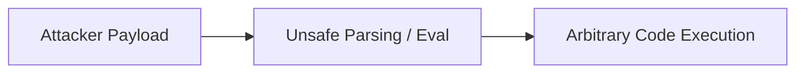

# CVE-[YEAR]-[ID]: [VULNERABILITY TITLE / SHORT NAME]

> **Severity / CVSS:** [e.g., 9.8 Critical (CVSS:3.1/AV:N/AC:L/PR:N/UI:N/S:U/C:H/I:H/A:H)]  
> **Affected Software / Versions:** [e.g., Apache Log4j 2.0-beta9 to 2.14.1]  
> **Patched In:** [e.g., 2.15.0 / 2.17.1]  
> **Advisory Link:** [NVD / Vendor Advisory URL]  
> **Tags:** `#security` `#cve` `#infosec` `#exploit-analysis`

---

## ⚡ 30-Second Summary (The Elevator Pitch)
What is the vulnerability, what does it allow an attacker to do (RCE, Auth Bypass, DoS, Info Leak), and why was it so impactful?

---

## 🎯 Vulnerability Root Cause Analysis
Explain the exact bug at the code / architecture level:
- **CWE Classification:** (e.g., CWE-502 Deserialization, CWE-78 OS Command Injection, CWE-120 Buffer Copy)
- **Flawed Code / Mechanism:** What was the developer trying to do vs. what actually happened?
- **Root Trigger:** Which input parameter or parser boundary was exploited?



---

## 🔬 Proof of Concept / Reproduction (Educational)
> *Educational & Defensive Analysis Only*

- **Minimal Reproduction Setup:**
- **Payload Structure:**
- **Execution Trace / GDB / Logs:**

```bash
# Reproduction or detection command
```

---

## 🛡️ Mitigation & Patch Deep Dive
- How did the vendor patch it?
- Code diff analysis (before vs. after).
- Defense-in-depth measures (WAF rules, runtime flags, network isolation).

---

## 💡 Key Lessons for Software Engineers & DevSecOps
- What coding habit or architectural flaw caused this?
- How to prevent similar vulnerabilities in your own codebases.

---

## 🔗 Primary References
- [NVD NIST Entry](https://nvd.nist.gov/)
- [Security Research Blog / Disclosure](https://...)
