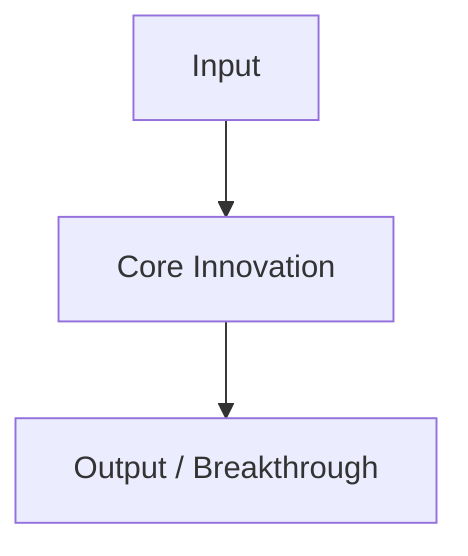

# [YEAR] - [PAPER / STANDARD TITLE]

> **Authors / Committee:** [Authors or Standards Committee, e.g. IEEE 802.11, ISO/IEC 27001]  
> **Published At / Venue:** [e.g., OSDI, SOSP, USENIX, arXiv, IEEE Transactions]  
> **Source Link / DOI:** [URL / DOI]  
> **Tags:** `#research-paper` `#distributed-systems` `#ai` `#standards`

---

## ⚡ 30-Second Summary (The Elevator Pitch)
What is the core breakthrough or standard introduced? What real-world bottleneck did it conquer?

---

## 🎯 The Problem & State of the Art Prior
- What existed before this paper/standard?
- What fundamental theoretical or practical limitations hit a wall?

---

## 🧠 Core Innovations & Architecture
Break down the paper's key algorithm, system design, or mathematical framework:
- **Key Concepts:**
- **System Diagram / Flowchart:**

---

## 📊 Benchmark & Empirical Results
- What did the experiments prove?
- Scalability, throughput, latency, or accuracy numbers.
- Any trade-offs or sacrifices (e.g., consistency vs. latency)?

---

## 🔬 Practical Lab / Implementation Notes
- Did you implement a toy version, benchmark an open-source implementation, or run the provided artifact?
- Code repository or demo notes.

---

## 💡 Industry Impact & Modern Relevance
- Where is this used in production today? (e.g., Google Spanner, Kafka, LLMs, Kubernetes).

---

## 🔗 References
- [Original Paper PDF](https://...)
- [Author Presentation / Slides](https://...)
