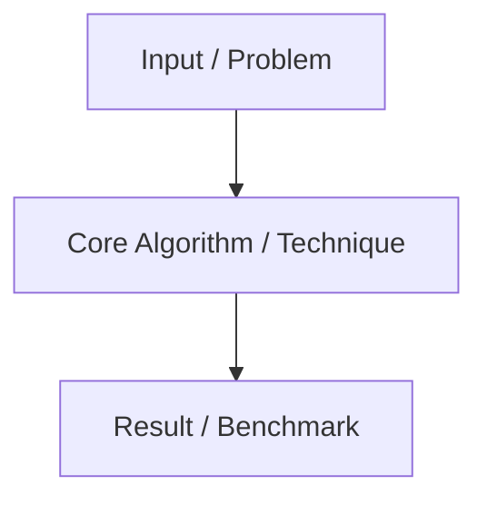

# [YEAR] - [PAPER / STANDARD TITLE]

- **Authors / Committee:** [Authors or working group]
- **Published In / Venue:** [e.g., OSDI, USENIX ATC, SOSP, arXiv, IEEE]
- **Source Link:** [PDF or DOI link]
- **Tags:** `[tag1]`, `[tag2]`

---

## The Core Idea
What is the primary breakthrough, algorithm, or finding presented in this paper?

---

## Prior Work & What Was Missing
- What systems or algorithms existed before this work?
- What theoretical or practical bottleneck prevented scaling?

---

## Architecture & Algorithm Details
Breakdown of the key mechanism:
- Major system components:
- Data structures or algorithmic guarantees:
- Tradeoffs made (e.g. latency vs consistency, CPU vs memory):

---

## Empirical Results & Benchmarks
- Key metrics reported by the authors (throughput, latency, accuracy, etc.):
- Test environment and workload characteristics:

---

## Production Relevance
- Where is this technique used in production systems today? (e.g., Kafka, Raft in etcd/Kubernetes, Transformer in LLMs)

---

## References
- [Original Paper](https://...)
- [Talk / Conference Presentation](https://...)
