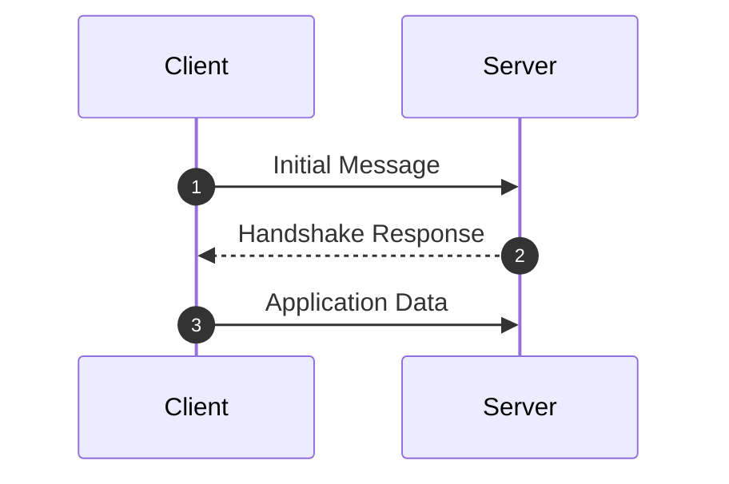

# RFC [NUMBER]: [TITLE]

- **Status:** [Draft / Proposed Standard / Internet Standard / Informational]
- **Working Group / Author:** [e.g., IETF HTTPbis / J. Reschke]
- **Source Link:** https://www.rfc-editor.org/rfc/rfc[NUMBER].html
- **Published:** [YYYY-MM]
- **Tags:** `[tag1]`, `[tag2]`

---

## What Problem Does This Solve?
Brief summary of why this RFC was created and what wasn't working in the previous specification.

---

## Background & Prior Limitations
- What protocol or mechanism was in place before this?
- What were the primary bottlenecks or pain points? (e.g. latency, head-of-line blocking, security limitations)

---

## Technical Breakdown

### Core Protocol Mechanics
Explain how the protocol works step-by-step:
- Packet/frame format
- State machine / handshake sequence
- Handling edge cases and connection state



---

## Local Lab & Testing
How to test or observe this protocol in action:
- Tools: `curl`, `tcpdump`, `wireshark`, or custom python script.
- Sample command:
```bash
# Test command
```

---

## Personal Takeaways & Gotchas
- Key lessons or real-world tradeoffs discovered while reading.
- Where this matters in production systems today.

---

## References
- [Official RFC](https://www.rfc-editor.org/rfc/rfc[NUMBER].html)
- [Errata / Related RFCs](https://...)
